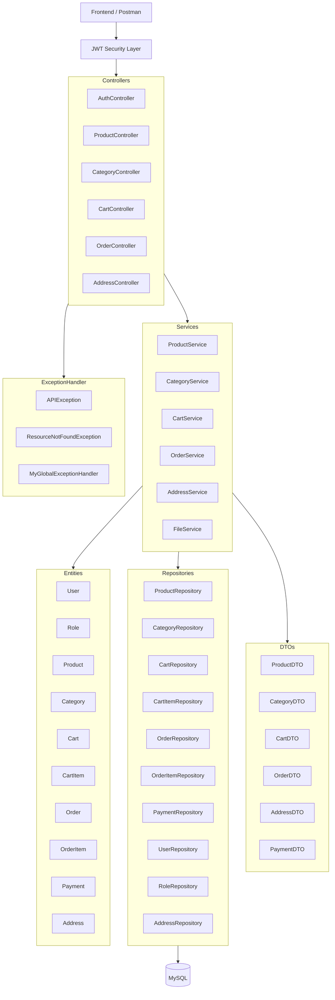
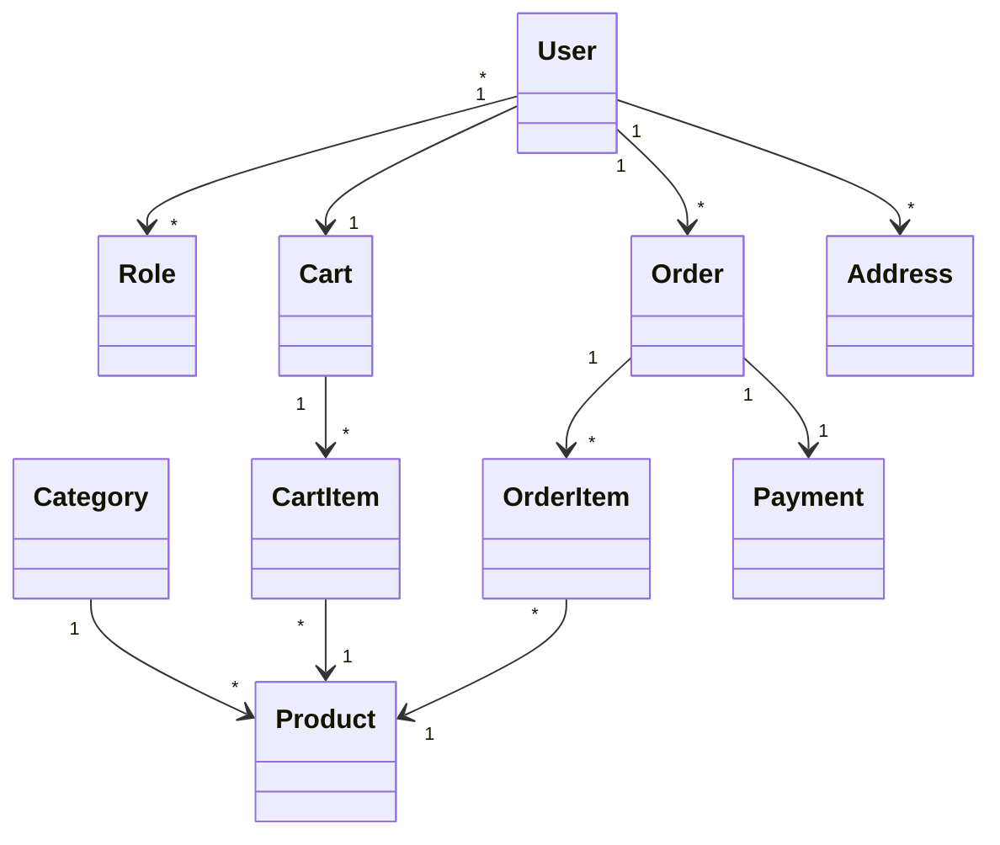

Project Overview

E-Commerce Backend Application is a RESTful API built using Java, Spring Boot, Spring Security, JWT, Hibernate, and MySQL. The system follows a layered architecture consisting of Controllers, Services, Repositories, DTOs, Security Components, and Entity Models. It supports authentication, product management, category management, cart operations, order processing, payment handling, and address management.

### Key Features

- User Registration and Login with JWT Authentication
- Role-Based Access Control (Admin/User)
- Product and Category Management
- Shopping Cart and Cart Item Management
- Order Creation and Tracking
- Payment Processing Module
- Address Management for Users
- Global Exception Handling
- DTO-Based Request and Response Handling
- Secure REST APIs using Spring Security
- MySQL Database Integration with Hibernate/JPA
- Layered Architecture for Maintainability and Scalability

UML Architecture Diagram

Entity Relationship UML

